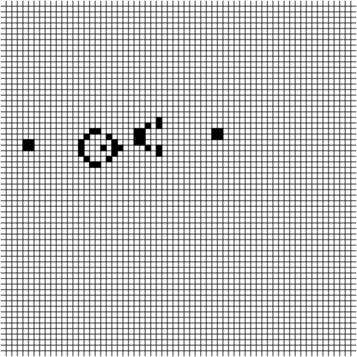
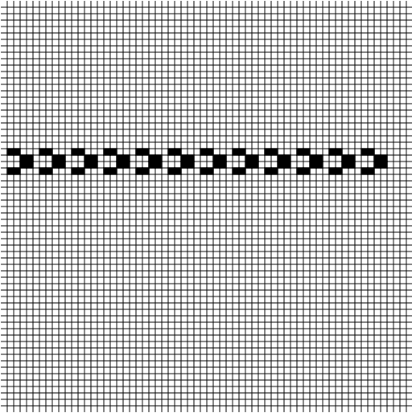
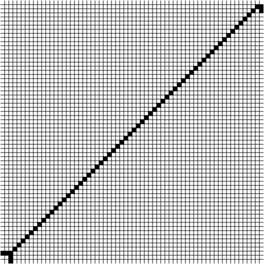

# Conway's Game of Life

This project is an implementation of the cellular automation devised by John Horton Conway in 1970.

I've recreated the system in JavaScript. Everything runs in the browser.

The application features a simple editing tool to make it a bit easier to create new patterns.

This project is no longer maintained. 
I only ever intended to spend a weekend on this.

Online demonstraction: https://tntmeijs.github.io/GameOfLife

# Showcase

**Gosper's glider gun**

---
**Ants**

---
**Steve Tower's Beacon Maker**

